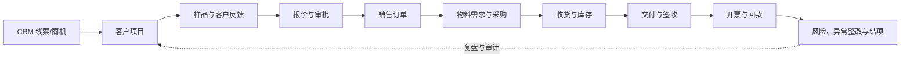

# AutoFlow 360

> 规划中的汽车零部件客户项目与供应链协同智能平台，目标是把 CRM 商机、样品、报价、采购、交付、回款、风险和异常整改串成可审计的完整闭环。

## 规划中的业务闭环



## 规划中的三条演示路径

1. **正常交付：** 商机转项目 → 打样通过 → 报价审批 → 订单 → 采购/库存 → 交付签收 → 开票回款 → 结项。
2. **供应商延期：** 采购交期偏离 → 确定性风险预警 → 创建业务异常 → 根因与整改 → 验证关闭。
3. **重新打样：** 客户反馈不通过 → 生成下一轮样品 → 保留前序证据 → 新一轮确认后继续报价。

## 快速开始

环境要求以 [上游基线](docs/research/upstream-baseline.md) 为准；实际启动由 `deploy/upstream-lock.json` 检出并校验四个上游仓库的精确提交，并由 `deploy/container-lock.json` 固定三个容器镜像摘要。先在 Windows PowerShell 中执行环境体检：

```powershell
Set-ExecutionPolicy -Scope Process Bypass
.\scripts\check-environment.ps1
```

本地开发脚本支持 Windows Docker，也支持直接安装在 WSL2 Ubuntu 内的 Docker Engine，不依赖 Docker Desktop。初始化前复制配置并修改示例管理员密码：

```powershell
Copy-Item deploy/env.example .env
# 编辑 .env 后再执行
.\scripts\bootstrap-dev.ps1
```

完整操作、数据库口令边界和排错说明见 [本地开发环境](docs/deployment/local-development.md)。本地 Frappe v16 环境已经完成真实安装，四个应用可被站点识别，当前安装级冒烟测试实际通过；后续业务能力仍以对应代码和测试为准。

## 测试命令

```powershell
python -m unittest discover -s tests/static -v
.\scripts\run-tests.ps1
git diff --check
```

所有业务实现遵守测试先行：先建立会失败的测试，再写最小实现并复测。性能、用户量和业务收益只记录实际测量结果，不使用推测数据。

## 上游边界

AutoFlow 360 是独立自定义应用，不是 Frappe、ERPNext 或 Frappe CRM 的官方产品，也不直接修改它们或 `frappe_docker` 的核心源码。

- **上游能力：** Frappe Framework 提供应用框架；Frappe CRM 提供线索、组织、联系人和商机；ERPNext 提供标准销售、采购、库存与财务单据；`frappe_docker` 提供容器工程参考。
- **规划中的自主新增范围：** 汽车客户项目、样品闭环、跨单据编排、确定性风险引擎、异常整改、客户/供应商门户扩展、可审计 AI 辅助、演示数据与自动化测试。上述范围计划自主实现，当前状态以实际代码和测试为准。
- **规划中的 AI 安全边界：** AI 只生成摘要、建议和草稿，不提交或取消业务单据，不改库存、不执行付款、不关闭异常，也不绕过审批；AI 不可用时核心业务仍可运行。

第三方来源与许可证见 [NOTICE.md](NOTICE.md)，当前采用线与待依赖拉取后锁定的精确提交基线见 [upstream-baseline.md](docs/research/upstream-baseline.md)。

## 合成数据声明

演示/测试输入是合成数据，测试结果和性能指标来自实际运行。合成的账号、客户、供应商、订单、金额、时间和风险不代表真实企业、真实客户、实际营收、实际采用规模或经营成效。

## 许可证

AutoFlow 360 自主代码采用 **AGPL-3.0-only**，官方全文见 [LICENSE](LICENSE)。第三方组件继续适用各自许可证与署名要求。
