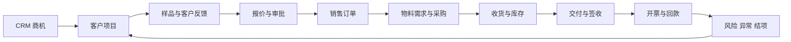
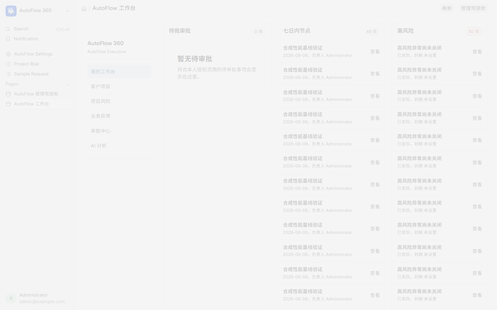
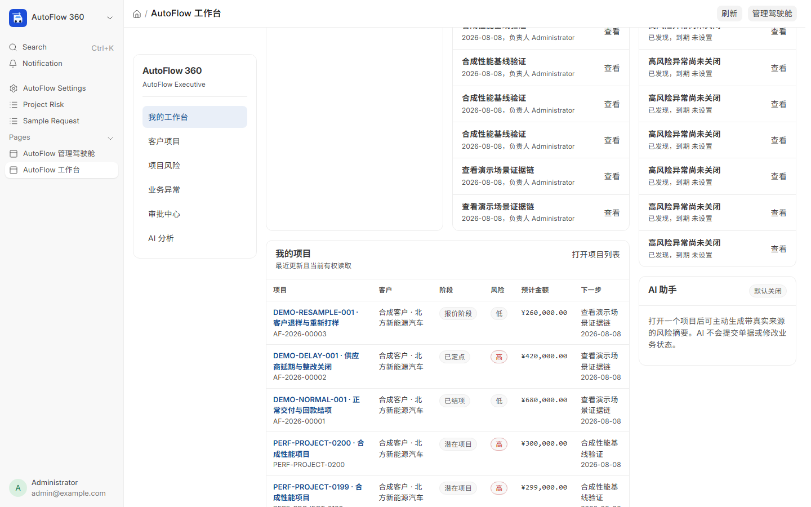
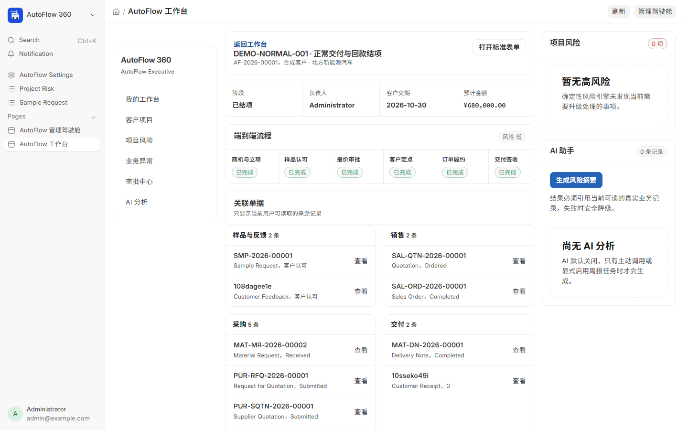
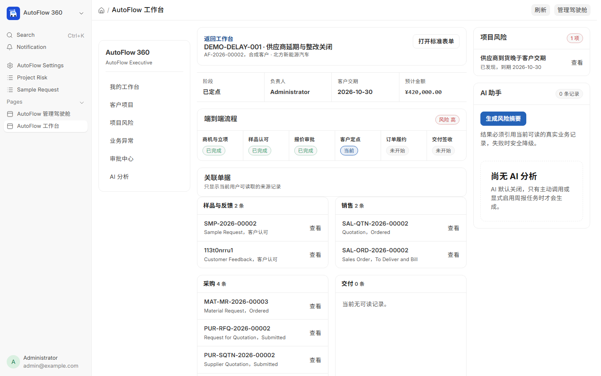
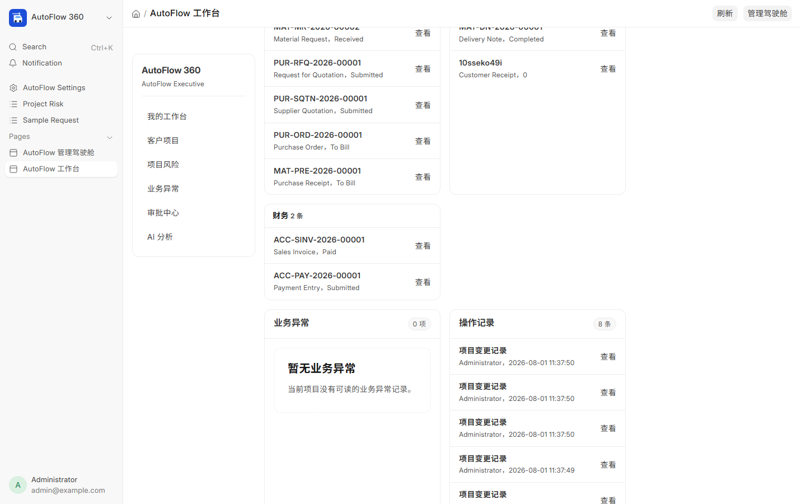
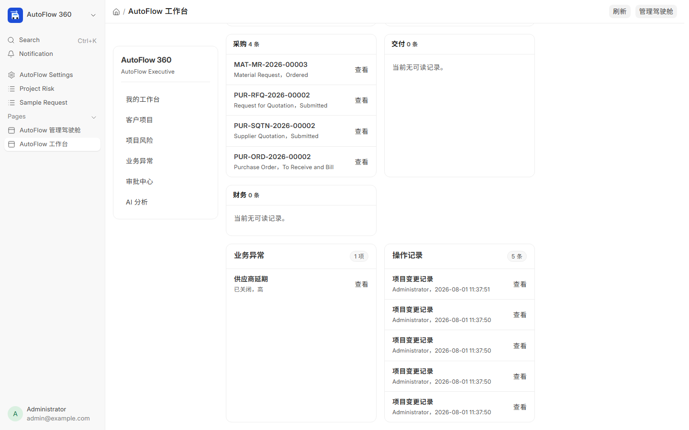
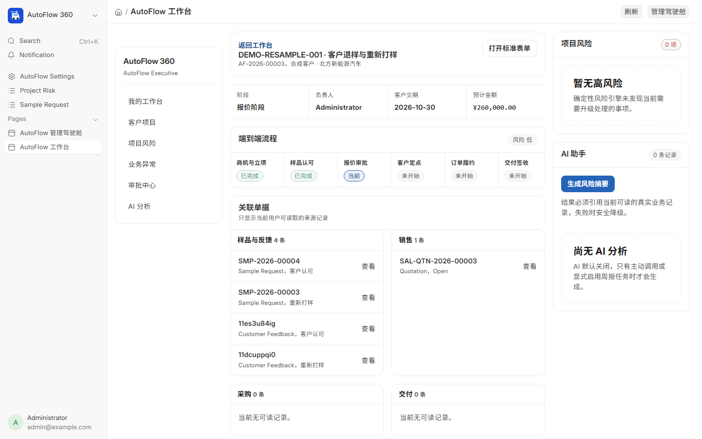
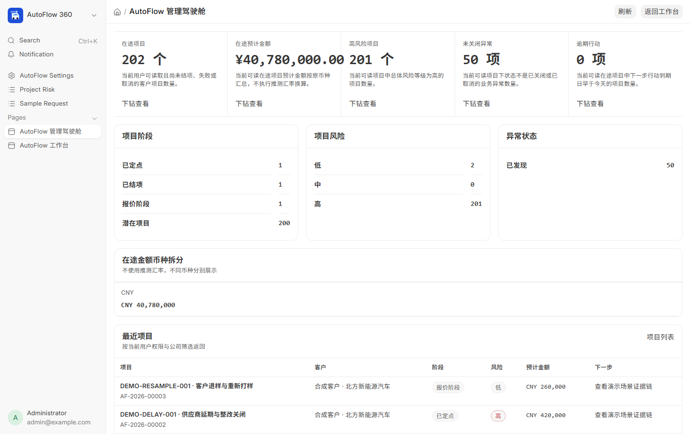
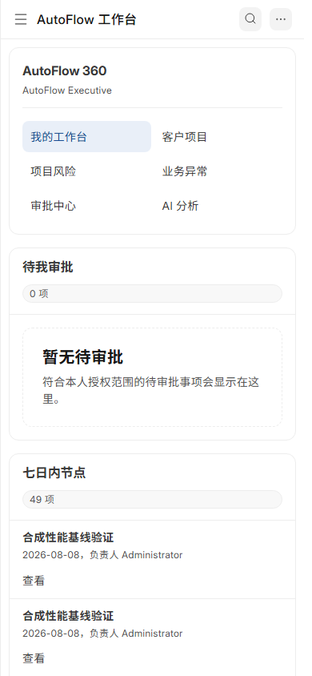

# AutoFlow 360

> 基于 Frappe CRM 与 ERPNext 的汽车零部件客户项目及供应链协同平台，把商机、样品、报价、采购、交付、回款、风险和异常整改串成可审计闭环。

## 一分钟了解

AutoFlow 360 不是重写一套 ERP。Frappe CRM 继续负责组织、联系人和商机，ERPNext 继续负责标准销售、采购、库存与财务单据；本项目用 `Customer Project` 建立跨单据主线，并新增汽车样品、额度审批、可解释物料缺口、客户/供应商门户、确定性风险、异常整改、严格结项、角色工作台、项目全景和只读 AI 建议。

当前全部使用 CNY 合成数据，未上线真实企业，也没有真实用户量、营收或客户采用结果。代码、测试、性能和限制均可从仓库核对。



## 已实现的自主扩展

| 上游能力 | AutoFlow 360 新增 |
| --- | --- |
| Frappe CRM 商机 | 幂等转客户项目、来源回写、公司/日期校验 |
| ERPNext 报价与销售订单 | 客户认可样品门槛、额度审批快照、幂等转单 |
| ERPNext 库存与采购 | 可解释物料缺口、RFQ、供应商隔离报价、ETA 审计 |
| ERPNext 交付与财务 | 订单来源、实时库存、超交拦截、客户签收、严格结项 |
| Frappe 账号与权限 | 七类内部角色、两类门户、项目成员、公司行级隔离 |
| Frappe 队列与 DocType | 八类确定性风险、异常根因/整改/独立验证 |
| 外部 AI API | 获权上下文、结构/来源校验、审计和失败安全降级 |
| frappe_docker | 锁定上游、多架构镜像、免费部署、备份恢复演练 |

## 三条可复现演示

| 场景 | 演示键 | 关键证据 |
| --- | --- | --- |
| 正常交付 | `DEMO-NORMAL-001` | 样品认可→报价审批→订单采购→签收→开票回款→结项 |
| 供应商延期 | `DEMO-DELAY-001` | ETA 偏离→确定性风险→根因整改→独立验证关闭 |
| 重新打样 | `DEMO-RESAMPLE-001` | 第一轮反馈→第二轮回链→新一轮认可 |

种子同时创建以下演示用户，密码由部署者单独设置，永不写入仓库：

- `autoflow-demo-executive@example.invalid`
- `autoflow-demo-procurement@example.invalid`
- `autoflow-demo-customer@example.invalid`
- `autoflow-demo-supplier@example.invalid`

完整讲解顺序见 [演示脚本](docs/demo-script.md)。以下截图于 2026-08-01 从本机真实站点自动采集并逐张验收，只包含 CNY 合成数据。演示视频包含 14 个动画分镜、14 段配音、62 组字幕和 13 个转场；完整预览获人工确认后，已于 2026-08-08 渲染为 1920×1080、30fps 的高质量 MP4，并通过完整解码、黑帧、长静音、响度、抽帧总览和尾帧检查。详细参数与 SHA-256 见 [成片报告](videos/autoflow-360-launch/RENDER-REPORT.md)。

## 产品截图

| 角色工作台 | 三场景项目组合 |
| --- | --- |
|  |  |

| 正常交付闭环 | 供应商延期闭环 |
| --- | --- |
|  |  |

| 财务结项证据 | 延期整改证据 |
| --- | --- |
|  |  |

| 重新打样证据链 | 管理驾驶舱 |
| --- | --- |
|  |  |

移动端同样经过 390×844 视口验收：



## 演示视频

视频工程位于 `videos/autoflow-360-launch/`，分镜、旁白、素材审计、字幕时间、离线动画依赖和完整时间线均保留在仓库中，可复核而不是只交付一个不可解释的成片。

```powershell
Set-Location videos\autoflow-360-launch
npm.cmd run dev
```

最终 MP4 位于本地 `videos/autoflow-360-launch/renders/video.mp4`，时长 162.633 秒、大小 62.498 MB。为避免把大型二进制文件写进 Git 历史，`renders/` 保持忽略；取得公开发布授权后，成片将作为 GitHub Release 附件上传，仓库保留可复现的视频工程和 [成片报告](videos/autoflow-360-launch/RENDER-REPORT.md)。

## 本地运行

要求：Windows 11 + WSL2 Ubuntu 或 Windows Docker、Docker Engine 23+、Docker Compose v2；具体上游提交见 `deploy/upstream-lock.json`，容器摘要见 `deploy/container-lock.json`。

```powershell
Set-ExecutionPolicy -Scope Process Bypass
.\scripts\check-environment.ps1
Copy-Item deploy/env.example .env
# 编辑 .env，把示例管理员密码改成独立随机密码
.\scripts\bootstrap-dev.ps1
.\scripts\bench.ps1 start
```

另开 PowerShell 生成合成演示数据：

```powershell
.\scripts\seed-demo.ps1
```

详细边界和排错见 [本地开发环境](docs/deployment/local-development.md)。

## 验证

```powershell
python -m unittest discover -s tests/static -v
.\scripts\run-tests.ps1
Set-Location tests\e2e
npx.cmd playwright test
Set-Location ..\..
.\scripts\verify-backup.ps1
git diff --check
```

截至 2026-08-01 的实际证据：

- 静态契约：170/170。
- 当前完整 Frappe 集成回归：148/148。
- Playwright：3/3；曾检出性能数据挤出演示项目的真实回归，修复后复测通过。
- 合成规模：200 项目、1000 样品、1000 反馈、500 销售订单、500 采购订单、5000 风险/异常/版本记录。
- 工作台列表 P50/P95：37.027/42.9 ms；项目全景：16.623/17.683 ms；每日风险扫描：4556.394/5888.688 ms。
- 恢复演练：数据库、公有附件、私有附件和站点配置完成 SHA-256 校验，恢复到一次性隔离站点并取得 `RESTORE_CHECK_PASSED`。

原始口径与发布门禁见 [验收报告](docs/test-report/acceptance.md) 和 [性能 JSON](docs/test-report/performance.json)。

## CI、镜像与免费部署

- `.github/workflows/static.yml`：静态契约、Python 编译、空白和 npm 安全检查。
- `.github/workflows/integration.yml`：锁定 Frappe 环境、完整业务测试、三条 Playwright 和性能证据。
- `.github/workflows/build-image.yml`：BuildKit secret、amd64/arm64、SBOM、provenance 和 GHCR。
- [Oracle 免费层部署](docs/deployment/oracle-always-free.md)：单机 HTTPS 路径；免费容量和政策不作永久承诺。
- [Cloudflare Quick Tunnel](docs/deployment/cloudflare-tunnel.md)：只用于临时面试演示，无 SLA。
- [备份与恢复](docs/deployment/backup-and-restore.md)：数据库/附件、SHA-256、一次性站点恢复。

尚未公开推送前，GitHub Actions、GHCR 镜像和在线演示都不会存在；仓库不把配置完成描述成远端已运行。

## 文档入口

- 架构：[系统上下文](docs/architecture/system-context.md) · [数据模型](docs/architecture/data-model.md) · [业务闭环](docs/architecture/business-flow.md)
- 用户：[销售与项目](docs/user-guide/sales-and-project.md) · [采购与交付](docs/user-guide/procurement-and-delivery.md) · [客户门户](docs/user-guide/customer-portal.md) · [供应商门户](docs/user-guide/supplier-portal.md) · [管理员](docs/user-guide/administrator.md)
- 安全：[威胁模型](docs/security/threat-model.md)
- 验收：[验收报告](docs/test-report/acceptance.md) · [已知限制](docs/test-report/known-limitations.md)
- 求职：[简历项目](docs/interview/resume-project.md) · [三分钟陈述](docs/interview/three-minute-pitch.md) · [面试问答](docs/interview/questions-and-answers.md) · [个人贡献](docs/interview/personal-contribution.md)

## 安全与真实性

前端按钮不是权限边界，所有敏感操作在服务端重新核对角色、项目、公司、客户/供应商关系和状态。关键转换使用文件锁、数据库行锁、唯一字段与幂等检查；AI 默认关闭，只生成带来源的建议，不提交/取消单据、不改库存、不付款、不关闭异常。

当前残余风险包括附件白名单、AI 域名限制、可变供应链引用、备份加密和公网限流；完整说明见 [威胁模型](docs/security/threat-model.md) 和 [已知限制](docs/test-report/known-limitations.md)。

## 来源与许可证

AutoFlow 360 是独立自定义应用，不是 Frappe、ERPNext 或 Frappe CRM 的官方产品，也不修改它们或 `frappe_docker` 的核心源码。第三方来源和许可证见 [NOTICE.md](NOTICE.md) 与 [上游基线](docs/research/upstream-baseline.md)。本项目自主代码采用 **AGPL-3.0-only**，全文见 [LICENSE](LICENSE)。
