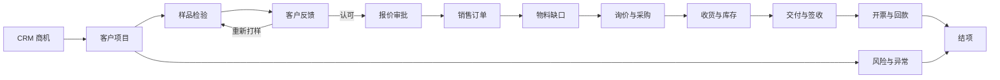

# 业务闭环

## 主流程

1. 销售把 Frappe CRM 商机转换为客户项目；服务端校验组织、联系人、公司、日期和权限，并用锁与唯一字段处理重复点击。
2. 项目创建样品，质量检验全部通过后才能发货。客户门户只能对所属项目提交认可、重新打样或拒绝反馈。
3. 报价必须已有客户认可样品。超过规则额度时生成不可冒用请求人身份的审批；审批通过且快照未变化后才能提交。
4. 报价幂等转换为销售订单。系统按订单数量、BOM/库存和已预留需求计算可解释物料缺口，再生成物料需求。
5. 采购把物料需求转 RFQ，受邀供应商在门户提交自己的报价；采购选择后生成采购订单，供应商交期变化会留下不可改写历史。
6. 收货形成库存。交付前校验销售订单来源、已交数量和实时库存，客户门户确认签收后生成唯一回执。
7. 结项服务逐项核对已提交交付、销售发票、付款分配、未关闭高风险/异常以及审批快照，不满足时只返回缺口，不强行关闭。

## 两条异常支线

- 供应商延期：交期偏离由确定性规则生成风险；业务人员创建异常，按“发现→分级→分派→根因→整改→待验证→关闭”推进，高风险要求独立验证和私有证据。
- 重新打样：客户选择重新打样后，服务生成下一轮样品并回链前一轮；旧反馈和旧样品保留，新的客户认可后才能进入报价。

## 辅助层

工作台按角色展示待办，管理驾驶舱聚合项目、风险和异常，项目全景页按时间线显示关联单据。AI 只在确定性闭环外生成有来源的建议，失败时记录降级状态，不阻断任何核心业务。
