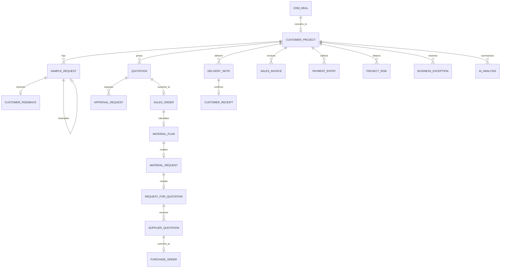

# 数据模型

核心聚合根是 `Customer Project`。它保存 CRM 商机来源、公司、客户、项目成员、阶段、关键日期、风险等级和演示标记；标准 ERPNext 单据通过 `custom_customer_project` 回链，不复制标准财务或库存字段。

## 关键约束

- `Customer Project.crm_deal` 唯一，商机重复转换返回同一个项目。
- `Sample Request.previous_sample_request` 唯一，一次客户“重新打样”决定只产生一条下一轮样品。
- 客户反馈只允许追加一次；最终反馈与样品状态保持一致。
- 报价审批绑定金额、公司、币种、客户和版本快照，源报价变化后旧审批失效。
- 物料计划记录需求、现有库存、已预留量、净缺口和计算依据；同一销售订单复用计划。
- RFQ、供应商报价、采购订单、交付、签收和结项服务都用唯一来源或已存在检查保证幂等。
- 风险保存规则编号、来源单据、来源快照和证据哈希；相同事实不会重复制造风险。
- 高风险异常必须由不同于提出人、责任人和整改执行人的用户验证。
- `AI Analysis` 保存输入哈希、提示版本、提供商、模型、状态、耗时、来源引用与安全错误码；不保存 API key。

## 权限维度

数据访问同时考虑角色、项目成员、Company User Permission、Customer/Supplier 的 Portal User 关系。客户只能读取所属客户的项目/样品/交付，供应商只能读取受邀询价和自己的报价/采购单。权限钩子在列表查询和单记录读取两处生效，避免只隐藏菜单但仍能直接访问对象。
