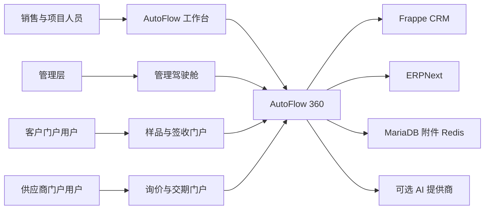

# 系统上下文

AutoFlow 360 是安装在同一 Frappe 站点中的独立自定义应用。它复用 Frappe CRM 的客户与商机能力、ERPNext 的销售/采购/库存/财务单据，在两者之间增加“客户项目”主线、样品闭环、审批、供应商/客户门户、确定性风险、异常整改、结项和只读 AI 辅助。

## 责任边界

| 组件 | 上游已有能力 | AutoFlow 360 新增能力 |
| --- | --- | --- |
| Frappe Framework | 账号、会话、DocType、权限、队列、文件、审计 | 角色矩阵、行级隔离、业务 API 和页面 |
| Frappe CRM | 组织、联系人、商机 | 商机幂等转客户项目、来源回写 |
| ERPNext | 报价、订单、采购、库存、交付、发票、付款 | 跨单据项目关联、业务门槛、完整性校验和全景聚合 |
| AutoFlow 360 | 无 | 项目主线、样品、审批、风险、异常、结项、门户、驾驶舱、AI 建议 |
| frappe_docker | 官方容器与 Compose 基线 | 固定上游提交、多架构镜像、免费部署和恢复脚本 |

## 运行边界

浏览器请求先进入 Frappe 的认证与 CSRF 层，再由 `autoflow_360/api/` 的白名单方法调用 `autoflow_360/services/`。业务服务不相信前端传入的角色或归属，而是重新查询项目、客户、供应商、公司和单据状态。MariaDB 是事实来源；工作台、驾驶舱、风险和 AI 都是对原始单据的聚合或辅助，不替代 ERPNext 财务/库存账。

AI 默认关闭，只读取当前用户有权限的字段并生成摘要、建议和草稿。它不提交订单、不改库存、不付款、不关闭异常。详见 `docs/security/threat-model.md`。
