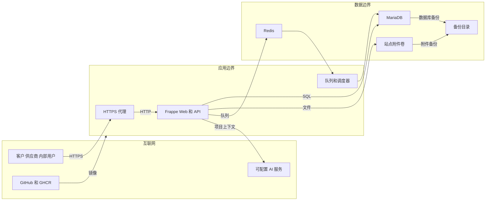

# AutoFlow 360 威胁模型

## Executive summary

AutoFlow 360 的最高风险集中在三处：客户/供应商及公司之间的行级隔离、生产构建与配置中的供应链/密钥保护、以及把项目上下文发送给可配置 AI 服务时的数据边界。仓库已经有 Frappe 会话与角色权限、对象级查询条件、文件所有权校验、业务状态锁、AI 输出结构和来源校验；但附件类型/大小、AI 目标地址、生产依赖不可变锁定、备份加密和公网限流仍需要部署侧或后续代码加固。

## Scope and assumptions

- 范围：`autoflow_360/` 运行时代码、门户/API、权限、AI、业务服务，以及 `.github/workflows/`、`deploy/`、`scripts/` 中影响交付安全的构建和运维代码。
- 预期用途：公开 GitHub 求职作品和临时互联网演示，访问者数量少，数据全部为合成演示数据。
- 部署模型：本地 WSL2/Docker 为验收基线；Cloudflare Quick Tunnel 仅临时演示；Oracle 单机 Compose 是可选免费路径，不视为高可用生产系统。
- 身份与权限：依赖 Frappe 会话、CSRF 防护、DocType 权限、项目成员、客户/供应商 Portal User 关系和 Company User Permission；前端显示控制不是授权边界。证据：`autoflow_360/hooks.py` 的权限钩子、`autoflow_360/permissions/project.py::customer_project_has_permission`、`autoflow_360/permissions/portal.py`。
- 数据敏感度：当前只允许合成业务数据；真实企业客户、报价、联系人、合同、发票和个人信息不在范围内。
- 范围外：正式生产运维团队、付费高可用、企业 SSO/WAF/SIEM、真实多租户服务、第三方 AI 提供商自身安全和 Oracle/Cloudflare 平台内部实现。

会显著改变风险排序的开放问题：未来是否导入真实客户/价格/联系人数据；是否允许长期公网访问；是否由多个相互不信任的公司共享一个站点；AI 服务是否为自建、境内合规服务或公共 API。用户此前授权按当前作品集演示假设继续，以上问题尚未给出更严格的生产答案。

## System model

### Primary components

- Frappe Web/Desk 和四个 Portal 页面提供浏览器入口；路由与权限钩子注册于 `autoflow_360/hooks.py`，页面实现位于 `autoflow_360/www/`。
- 白名单 API 位于 `autoflow_360/api/`，把经过会话身份的请求交给确定性业务服务。
- 行级权限由 `autoflow_360/permissions/project.py` 和 `autoflow_360/permissions/portal.py` 执行；角色基础权限由 `autoflow_360/setup/permissions.py` 安装。
- 业务状态机、审批、并发锁和幂等逻辑位于 `autoflow_360/services/` 与自定义 DocType 控制器。
- AI 上下文构建、提供商调用、结构校验和审计位于 `autoflow_360/ai/`；默认关闭，设置只允许系统管理员角色读写。证据：`autoflow_360/autoflow_360/doctype/autoflow_settings/autoflow_settings.json`。
- MariaDB 保存业务数据与配置，Redis 承载缓存/队列，站点卷保存附件；生产容器拓扑由锁定的官方 Compose 与 `deploy/oracle/compose.platform.yaml` 组合。
- CI 检查静态契约、完整 Frappe 测试、三条 Playwright 流程和性能；发布工作流用 BuildKit secret 构建 amd64/arm64 镜像。证据：`.github/workflows/static.yml`、`.github/workflows/integration.yml`、`.github/workflows/build-image.yml`。

### Data flows and trust boundaries

- 互联网用户 -> Frappe：凭据、表单、标识符、报价条目、反馈和附件 URL 经 HTTPS/HTTP 进入；Frappe 会话、方法限制和框架 CSRF 是基础保证，API 再做角色、对象和状态校验；仓库未自行实现公网限流。
- Frappe -> MariaDB/站点卷：项目、订单、审批、附件元数据和审计记录通过框架 ORM/参数化 SQL 持久化；关键转换使用 `filelock` 与数据库 `for_update`，附件内容解析由上游 Frappe 负责。
- Frappe -> Redis/后台任务：风险扫描和 AI 周报进入队列；任务共享站点数据权限边界，调度器属于受信任运维面。证据：`autoflow_360/hooks.py::scheduler_events`。
- Frappe -> AI 提供商：经用户权限过滤后的项目 JSON、业务金额和单据摘要通过可配置 HTTP(S) 发送；输出必须通过 `autoflow_360/ai/schemas.py::parse_ai_result` 和 `autoflow_360/ai/audit.py::validate_result_sources`，但目标地址目前只校验协议和主机存在。
- 开发者 -> GitHub Actions/GHCR：源码、依赖引用、短期 GitHub 令牌和镜像产物跨越构建信任边界；应用清单通过 BuildKit secret 进入构建，仓库不保存令牌。证据：`.github/workflows/build-image.yml`。
- 运维者 -> Docker/备份：`compose.env` 中的数据库和管理员密码进入本机 Docker API；备份从站点卷复制到被 Git 忽略的私有目录并生成哈希，当前没有自动异地加密。证据：`deploy/oracle/common.sh`、`backup.sh`、`restore-check.sh`。

#### Diagram

## Assets and security objectives

| Asset | Why it matters | Security objective (C/I/A) |
| --- | --- | --- |
| 客户项目、报价、采购、发票与回款记录 | 泄露会暴露商业关系和价格，篡改会破坏完整闭环 | C/I/A |
| 客户/供应商身份映射与 Company User Permission | 决定行级隔离，错误会造成横向或跨公司访问 | I/C |
| 审批、风险、异常和审计轨迹 | 面试证据和业务责任链依赖其不可抵赖性 | I/A |
| 私有附件和签收/整改证据 | 可能含业务证明，错误公开或替换会伤害用户 | C/I |
| 管理员、数据库、AI 与 GitHub 凭据 | 泄露可导致接管、外传或产物污染 | C/I |
| AI 输入、输出、来源引用 | 输入可能包含业务数据，输出不得越权或伪装为已执行动作 | C/I |
| 容器镜像、依赖锁和 CI 产物 | 被污染会把恶意代码交付到演示/生产环境 | I |
| 备份及恢复能力 | 是误删、升级失败和磁盘故障后的最后恢复手段 | C/I/A |

## Attacker model

### Capabilities

- 未登录互联网访问者可以访问公开登录面和 Quick Tunnel 地址，并可发起扫描、登录尝试和流量消耗。
- 已登录客户或供应商可以控制自己提交的文本、单据标识符、条目数组和已上传文件引用，并尝试读取或修改其他主体对象。
- 普通内部用户可以尝试跨项目、跨公司访问或绕过审批/状态机。
- 能提交拉取请求的开发者可影响 CI 输入；上游仓库或 GitHub Action 被攻陷时可影响构建。
- 拿到服务器文件读取或 Docker 权限的攻击者可读取生成的 Compose、站点卷和备份；Docker 权限本身视为主机 root 等价权限。

### Non-capabilities

- 默认不假设攻击者已拥有 Administrator/System Manager、Oracle 控制台、GitHub 仓库写权限或 Docker socket。
- 默认不假设 AI 文本能够直接执行工具、SQL 或业务操作；当前 AI 仅生成经结构校验的建议。
- 默认不把合成演示数据当作真实个人信息；如果导入真实数据，多个中等级风险将升级为高风险。
- 不把恶意云平台管理员、硬件侧信道或 Frappe/ERPNext 未公开零日漏洞纳入本次仓库级建模。

## Entry points and attack surfaces

| Surface | How reached | Trust boundary | Notes | Evidence (repo path / symbol) |
| --- | --- | --- | --- | --- |
| 客户样品与签收 API | 登录后 POST | 客户浏览器 -> Frappe | 校验客户项目或交付归属，附件校验所有者 | `autoflow_360/api/portal.py`; `services/delivery.py::confirm_customer_receipt` |
| 供应商报价与 ETA API | 登录后 POST | 供应商浏览器 -> Frappe | 业务服务再次核对受邀供应商/采购单供应商 | `autoflow_360/api/portal.py`; `services/procurement.py` |
| 客户/供应商 Portal 页面 | 登录后 GET | 互联网 -> Web 页面 | 先要求 Portal 角色，再按 Customer/Supplier 关系查询 | `autoflow_360/www/*.py` |
| 内部工作台与分析 API | 登录后 GET/POST | 内部用户 -> Frappe | 要求内部角色、项目读取权限与管理角色 | `autoflow_360/api/analytics.py` |
| 附件引用 | API 表单参数 | 用户 -> 站点文件卷 | 校验 File 所有者；部分流程要求私有，但未增加业务 MIME/大小白名单 | `api/portal.py::_validate_owned_attachment`; `services/exception_workflow.py::_validate_owned_private_file` |
| AI 配置与调用 | 管理员设置、内部分析请求 | Frappe -> 外部 HTTP(S) | API key 为 Password 字段，默认关闭；目标 URL 未阻止内网地址 | `doctype/autoflow_settings/*`; `ai/providers/openai_compatible.py` |
| 调度和后台队列 | Frappe scheduler | 受信任调度器 -> 数据/AI | 批量扫描和周报可能放大资源消耗 | `autoflow_360/hooks.py::scheduler_events` |
| 镜像构建 | 标签或手动工作流 | GitHub -> BuildKit/GHCR | BuildKit secret、SBOM 和 provenance 已启用；应用分支和 Action 主版本标签仍可变 | `.github/workflows/build-image.yml`; `deploy/apps.production.json` |
| 生产配置与 Docker | SSH 本机运维 | 运维者 -> Docker/root | 严格解析 env、要求 600、拒绝占位符 | `deploy/oracle/common.sh`; `deploy/oracle/deploy.sh` |
| 备份/恢复 | SSH 或本机脚本 | 数据卷 -> 本地备份 | SHA-256、路径约束、一次性站点；未自动加密或异地复制 | `deploy/oracle/backup.sh`; `restore-check.sh` |

## Top abuse paths

1. 横向读取：客户提交另一个样品/交付标识符 -> API 若只按名称加载 -> 读取或提交他方反馈。现有项目/客户二次校验阻断主要路径，但每个新增 API 都必须复用相同控制。
2. 跨公司访问：内部用户获得业务角色但缺少 Company User Permission -> 查询条件按设计不限制公司 -> 看到不应负责的公司项目；风险取决于账号配置流程。
3. 附件滥用：合法用户上传超大或不期望类型文件 -> 提交自己拥有的 File URL -> 消耗存储/解析资源或诱导下载；当前只在部分流程检查私有属性。
4. AI 数据外传：管理员把 AI Base URL 配到错误或恶意主机 -> 内部用户触发分析 -> 经权限过滤的项目摘要和金额离开站点。
5. 提示注入：攻击者把指令文本写入项目/风险描述 -> AI 把它当上下文 -> 生成误导性建议；来源白名单和“只建议不执行”降低完整性影响，但不能保证语义正确。
6. 并发重复：用户重复点击审批、转单、签收或 ETA -> 两个请求竞争 -> 生成重复单据或越过状态。文件锁、行锁、唯一字段和幂等查询已覆盖主要转换，剩余风险集中在新增流程。
7. 构建污染：上游应用分支或主版本 GitHub Action 被篡改 -> 发布工作流拉取变化 -> 恶意代码进入多架构镜像并分发。
8. 凭据/备份泄露：运维者误提交 `compose.env` 或复制未加密备份 -> 数据库密码、站点数据和私有附件暴露；Git 忽略和密钥扫描减少误提交但不保护服务器被读。
9. Quick Tunnel 暴露：临时地址被发现 -> 登录尝试和流量消耗 -> 单机演示中断；当前没有仓库级 WAF/速率限制，需依赖 Frappe/Cloudflare 和短时开放策略。

## Threat model table

| Threat ID | Threat source | Prerequisites | Threat action | Impact | Impacted assets | Existing controls (evidence) | Gaps | Recommended mitigations | Detection ideas | Likelihood | Impact severity | Priority |
| --- | --- | --- | --- | --- | --- | --- | --- | --- | --- | --- | --- | --- |
| TM-001 | 已登录客户/供应商 | 有一个合法 Portal 账号并能猜测对象名 | 替换 API 中的样品、询价、采购单或交付标识符以横向访问 | 他方业务数据泄露或被篡改 | 项目、订单、反馈、签收 | 行级查询/对象钩子和服务内二次校验；`permissions/portal.py`、`api/portal.py` | 新增 API 容易遗漏同一模式，部分 `has_permission` 对非 Portal 用户返回上游结果语义需持续回归 | 为每个白名单方法增加“他方主体”负向测试；集中封装 Customer/Supplier 对象授权；代码评审强制检查 IDOR | 记录 PermissionError 的用户、对象类型、对象名哈希和频率；对连续越权尝试告警 | 中：现有覆盖较强但入口多 | 高：真实数据场景会跨主体泄露 | high |
| TM-002 | 普通内部用户或错误配置者 | 用户有内部角色，Company User Permission 缺失或配错 | 利用全局角色或空公司限制读取其他公司项目 | 跨公司商业数据泄露 | 项目、报价、供应链数据 | `permissions/project.py::_allowed_companies` 和项目成员条件；权限集成测试 | “没有 Company User Permission”对部分全局角色等于不限制，这是配置假设而非强租户边界 | 若进入真实多公司生产，默认拒绝无公司权限账号；建立入离职/角色变更审计；为每个内部角色增加跨公司矩阵测试 | 定期导出角色与 User Permission 差异；监测异常公司跨度查询 | 中：依赖账号治理 | 高 | high |
| TM-003 | 已登录用户 | 能上传文件并提交自己的 File URL | 上传超大、危险扩展名或内容伪装文件，消耗资源或诱导下载 | 可用性下降、恶意内容传播 | 附件卷、用户终端、服务可用性 | 文件所有者校验；签收/整改要求私有文件；反向代理有 `CLIENT_MAX_BODY_SIZE` | 业务层未统一限制扩展名、MIME、单文件大小和病毒扫描；样品附件不强制私有 | 在统一上传入口增加允许类型、魔数和大小校验；所有证据默认私有；生产接入恶意软件扫描；20m 只是代理上限不是业务白名单 | 记录上传大小、类型、拒绝原因和存储增长；异常增长告警 | 中 | 中 | medium |
| TM-004 | 恶意业务文本、误配管理员或恶意 AI 服务 | AI 被启用并配置外部 Base URL | 通过提示注入影响建议，或把获权上下文发送到错误主机 | 商业数据外传、误导决策 | AI 输入/输出、项目和金额 | 默认关闭；仅内部角色；上下文先走 Frappe 权限；严格 schema、长度/数量上限、来源白名单；`ai/service.py`、`ai/schemas.py`、`ai/audit.py` | Base URL 允许 HTTP 和内网/环回地址；无提供商域名允许列表；语义正确性无法由 schema 保证 | 生产只允许 HTTPS 和管理员批准域名；阻止环回、链路本地、私网及重定向；明确数据处理协议；UI 永远标注“建议、待人工确认” | 审计目标域名、调用者、输入哈希、延迟、错误码和返回来源；域名变化告警 | 中：默认关闭使暴露降低 | 高：真实数据时可能外传 | high |
| TM-005 | 已登录业务用户 | 能并发提交同一业务动作 | 重复创建订单、签收、审批或绕过状态顺序 | 单据完整性受损 | 订单、审批、库存、审计 | `filelock`、`for_update=True`、状态机、唯一字段和已存在查询；`services/sample_workflow.py`、`sales_conversion.py`、`procurement.py` | 所有新增转换必须自行应用模式；锁超时仅返回失败，缺少统一重试/冲突指标 | 建立事务级幂等键表或请求令牌；对所有变更入口做并发测试；返回可识别冲突码 | 统计锁超时、唯一约束冲突和同源多次请求 | 低到中 | 高 | medium |
| TM-006 | 开发者、CI 日志读者、主机本地用户 | 能查看构建日志、生成配置、备份或工作目录 | 读取或误提交管理员/数据库/AI/GitHub 凭据 | 账号或环境被接管 | 所有凭据、业务数据 | `.gitignore`、候选文件密钥扫描、BuildKit secret、随机 CI 密码和日志脱敏；`tests/static/test_secret_hygiene.py`、工作流、`deploy/oracle/common.sh` | 生成 Compose 仍含展开后的数据库密码；Docker/root 用户可读；静态正则不能发现所有密钥 | 生产优先 Docker secrets/外部密钥管理；缩短令牌权限和寿命；发布前运行专用 secret scanner；禁止上传 `.env`/站点配置/完整日志 | GitHub secret scanning、文件权限巡检、凭据轮换记录和异常登录告警 | 中 | 高 | high |
| TM-007 | 被攻陷的上游仓库、Action 或包发布者 | 构建时联网拉取可变引用 | 通过上游分支或 Action 主版本标签注入代码 | 镜像与发布链被污染 | 镜像、CI、部署环境 | `frappe_docker` 精确提交锁；Playwright 精确版本/锁文件；镜像生成 SBOM/provenance；最小 workflow 权限 | ERPNext `version-16`、CRM `main`、当前项目分支和 Action `vN` 仍为可变引用；镜像尚未做签名验证 | 正式发布时把本项目切换到不可变标签；记录三应用实际 commit；将 Actions 固定到审计过的完整 SHA；用 Cosign 签名并在部署前验证 | 对依赖 commit 漂移、工作流文件和镜像摘要变化告警；保留构建证明 | 中 | 高 | high |
| TM-008 | 主机读取者、误操作或磁盘故障 | 能访问未加密备份，或备份只保存在同一主机 | 窃取/篡改备份，或在故障时发现不可恢复 | 数据泄露或永久丢失 | 数据库、附件、恢复能力 | SHA-256 清单、路径约束、一次性恢复站点、迁移和最小读取；`backup.sh`、`restore-check.sh` | 清单与文件同处，不能抵御恶意同时篡改；无自动加密、签名和异地副本 | 对真实数据启用 Frappe 备份加密；使用独立密钥加密异地副本；清单签名另存；按月恢复演练和磁盘容量告警 | 记录备份时间、大小、哈希、恢复结果和最近成功恢复时间 | 中 | 高 | high |
| TM-009 | 未登录互联网访问者 | Quick Tunnel 或单机公网地址开放 | 登录爆破、扫描和流量消耗 | 演示中断、账号风险 | 可用性、用户账号 | Frappe 登录/会话；HTTPS 代理；Quick Tunnel 仅短时使用且脚本先健康检查 | 仓库未配置 WAF、强制 MFA、独立限流和 SLA；免费单机无冗余 | 只用合成数据和专用演示账号；演示后立即关闭；长期入口使用命名 Tunnel/Access、MFA、速率限制和防火墙 | 登录失败、429/5xx、CPU/内存和连接数告警 | 中 | 中 | medium |

## Criticality calibration

- critical：无需登录即可执行服务器代码；绕过身份认证取得 Administrator；公开镜像构建凭据可直接改写发布产物。当前未确认存在此级问题。
- high：客户/供应商或公司间真实数据批量泄露；数据库/管理员密钥被盗；恶意代码进入已发布镜像。TM-001、TM-002、TM-006、TM-007 在真实数据或正式发布条件下属于此级。
- medium：需要合法低权限账号的单对象篡改；附件导致可恢复的资源耗尽；AI 建议被误导但仍需人工确认；临时隧道被打断。TM-003、TM-005、TM-009 属于此级。
- low：仅暴露版本/非敏感合成标识；必须先取得服务器 root 才能触发且不增加攻击能力；明显、短暂、可立即恢复的演示噪声。此类问题仍应记录，但不阻断求职演示。

风险排序最受“是否导入真实数据、是否长期公网、多公司是否互不信任、AI 是否外部托管”四项假设影响。

## Focus paths for security review

| Path | Why it matters | Related Threat IDs |
| --- | --- | --- |
| `autoflow_360/permissions/project.py` | 公司、项目成员和内部角色的核心行级边界 | TM-001, TM-002 |
| `autoflow_360/permissions/portal.py` | 客户/供应商对象级查询和权限钩子集中地 | TM-001, TM-002 |
| `autoflow_360/api/portal.py` | 外部 Portal 的四个可变更 API 入口和附件引用 | TM-001, TM-003, TM-005 |
| `autoflow_360/www/` | 门户页面直接组合客户/供应商可见数据 | TM-001 |
| `autoflow_360/services/procurement.py` | 供应商报价、采购和 ETA 的授权、锁与幂等 | TM-001, TM-005 |
| `autoflow_360/services/delivery.py` | 库存、交付数量、客户签收和私有证明 | TM-001, TM-003, TM-005 |
| `autoflow_360/services/exception_workflow.py` | 整改证据、独立验证和高风险状态转换 | TM-003, TM-005 |
| `autoflow_360/ai/context_builder.py` | 决定哪些获权业务字段会离开站点 | TM-004 |
| `autoflow_360/ai/providers/openai_compatible.py` | 外部 URL、API key、超时和响应解析边界 | TM-004, TM-006 |
| `autoflow_360/autoflow_360/doctype/autoflow_settings/` | AI 开关、目标 URL、模型和密码字段的管理面 | TM-004, TM-006 |
| `autoflow_360/hooks.py` | 权限钩子、事件和调度器的总入口 | TM-001, TM-002, TM-004 |
| `.github/workflows/` | 令牌权限、外部 Action、依赖拉取和发布 | TM-006, TM-007 |
| `deploy/apps.production.json` | 生产镜像中三个应用的来源和可变引用 | TM-007 |
| `deploy/oracle/common.sh` | 敏感 env 解析、权限和路径边界 | TM-006, TM-008 |
| `deploy/oracle/backup.sh` | 备份导出、哈希和临时路径清理 | TM-008 |
| `deploy/oracle/restore-check.sh` | 临时站点创建、恢复和受限删除 | TM-005, TM-008 |

### Quality check

- 已覆盖发现的 Portal、白名单 API、内部分析、附件、AI、调度、CI、容器和备份入口。
- 每条运行时、外部 AI、构建和备份信任边界都至少映射到一个威胁。
- 已明确区分运行时控制、CI/开发工具和演示测试；没有把前端控制当作服务端授权。
- 已记录用户未进一步指定生产服务上下文，并用合成数据、少量访客、临时公网假设校准风险。
- 未在文档中复制任何真实密钥、密码或站点配置值。
