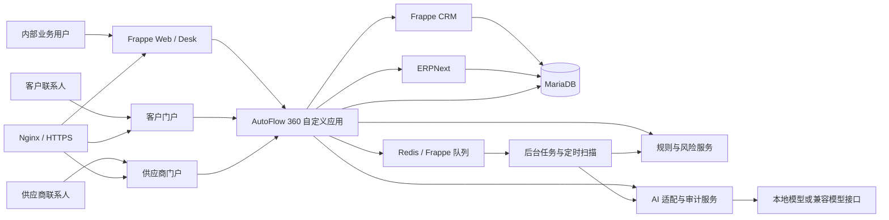
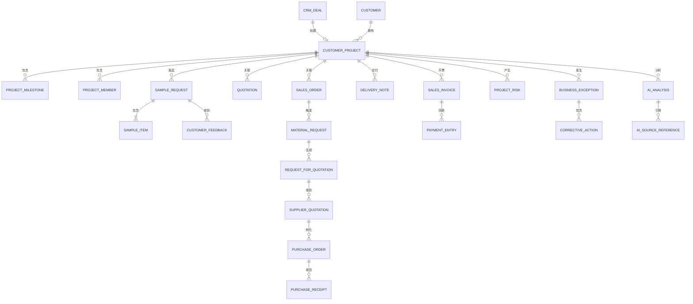
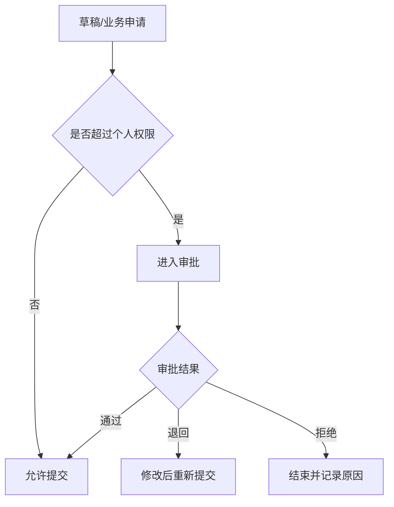
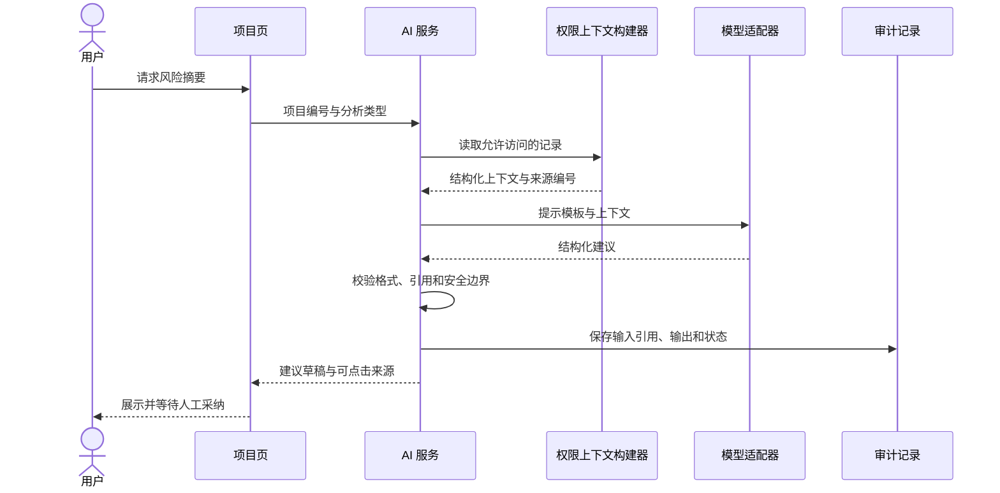

# AutoFlow 360 技术设计说明

> 日期：2026-07-29
>
> 设计状态：已确认
>
> 对应产品规格：`Product-Spec.md`

## 1. 设计目标

本设计把 AutoFlow 360 落在一个可维护、可测试、可部署的工程结构中。系统复用 Frappe CRM 与 ERPNext 的成熟业务对象，在独立 Frappe 应用 `autoflow_360` 内实现汽车零部件客户项目、样品、风险、异常、门户和 AI 扩展。

设计优先级如下：

1. 端到端业务闭环真实可运行。
2. 上游能力与自研能力边界清楚。
3. 权限、审批、审计和异常处理可靠。
4. AI 有来源、可降级、不越权。
5. 开发、测试和部署可以复现。
6. 产出可用于 2027 秋招的项目证据。

## 2. 关键决策

### 2.1 选择 Frappe 生态

采用 Frappe Framework v16、ERPNext v16 stable 和 Frappe CRM stable v1。三者共享 Frappe 数据模型、权限、工作流和后台任务体系，能减少 CRM 与 ERP 跨系统同步的复杂度。

未选择纯前后端从零开发，原因是本项目的含金量应集中在汽车客户项目与供应链协同，而不是重复实现用户、权限、采购、库存和会计基础能力。

### 2.2 独立自定义应用

所有新增能力进入 `autoflow_360`，不直接修改上游核心仓库。这样可以：

- 通过版本锁定复现环境。
- 清楚展示个人新增代码。
- 保留上游升级路径。
- 降低许可证和署名表述风险。

### 2.3 同站点集成

CRM、ERPNext 和 AutoFlow 360 安装在同一 Frappe Site（站点）中。业务记录通过链接字段和服务层关联，不使用跨系统消息同步作为首版主方案。

### 2.4 规则优先、AI 增强

高风险判断由确定性规则完成，AI 负责摘要、解释、建议和草稿。即使模型关闭，业务闭环、风险扫描和审批仍正常运行。

### 2.5 免费优先部署

开发和验收以本地 Docker 为基线；公网首选 Oracle Cloud Always Free，容量不可用时使用本地 Docker 与 Cloudflare Tunnel 临时展示。任何收费资源都不作为验收前提。

## 3. 总体架构



### 3.1 组件职责

| 组件 | 职责 | 不负责 |
| --- | --- | --- |
| Frappe CRM | 线索、组织、联系人、商机 | 采购、库存、财务 |
| ERPNext | 报价、订单、采购、库存、交付、发票、付款 | 行业项目与样品闭环 |
| AutoFlow 360 | 客户项目、样品、风险、异常、门户扩展、AI | 重写标准 ERP 会计逻辑 |
| 规则服务 | 确定性风险判断、去重、状态建议 | 自由文本推理 |
| AI 服务 | 摘要、建议、草稿、带来源问答 | 自动提交关键业务动作 |
| 后台任务 | 定时扫描、异步生成、通知 | 绕过权限修改业务状态 |

## 4. 仓库结构

预计仓库结构：

```text
.
├─ autoflow_360/                  # 独立 Frappe 应用
│  ├─ autoflow_360/
│  │  ├─ doctype/                # 自定义 DocType
│  │  ├─ services/               # 跨对象业务服务
│  │  ├─ risk_engine/            # 风险规则与解释
│  │  ├─ ai/                     # 模型适配、提示模板、审计
│  │  ├─ portal/                 # 客户和供应商门户
│  │  ├─ reports/                # 业务报表
│  │  ├─ dashboards/             # 管理驾驶舱
│  │  ├─ fixtures/               # 角色、工作流、自定义字段
│  │  ├─ patches/                # 数据迁移
│  │  └─ tests/                  # 单元和集成测试
│  ├─ pyproject.toml
│  └─ README.md
├─ deploy/
│  ├─ docker/
│  ├─ apps.json                  # 上游应用版本锁定
│  ├─ compose.yaml
│  └─ env.example
├─ scripts/
│  ├─ setup.ps1
│  ├─ setup.sh
│  ├─ seed_demo_data.sh
│  ├─ test.sh
│  └─ backup_restore_check.sh
├─ tests/
│  └─ e2e/                       # 浏览器端到端测试
├─ docs/
│  ├─ architecture/
│  ├─ deployment/
│  ├─ user-guide/
│  ├─ interview/
│  └─ superpowers/specs/
├─ .github/workflows/
├─ Product-Spec.md
├─ LICENSE
└─ README.md
```

实际生成应用时，以 Frappe CLI 的标准目录为准；此结构用于约束模块边界。

## 5. 数据模型

### 5.1 关系总览



### 5.2 Customer Project

关键字段：

- 项目编号、项目名称、公司、客户、CRM 商机。
- 产品族、预计金额、赢单概率、负责人、项目成员。
- 目标定点日期、客户要求交付日期、最近有效活动时间。
- 当前阶段、总体风险等级、下一步行动。
- 暂停/失败/取消原因和结项复盘。

状态由服务层根据样品、报价、订单、交付、发票、回款和异常共同计算。允许用户发起状态操作，但不能直接绕过前置条件写入最终状态。

### 5.3 Sample Request

关键字段：

- 客户项目、轮次、上轮样品、用途、要求日期。
- 审批状态、制作状态、检验状态、发货和反馈状态。
- 客户联系人、发货信息、检验附件。

`Sample Item` 保存物料、数量、规格、批次和检验结果。`Customer Feedback` 保存客户结论、原因、附件和门户操作人。

### 5.4 Project Risk

关键字段：

- 客户项目、风险类型、等级、标题和说明。
- 规则编码、来源对象、来源记录、规则输入快照。
- 责任人、截止日期、状态和验证结果。
- 去重键：公司、项目、规则、来源记录和有效时间窗。

风险由规则产生时，保存可解释的触发条件。人工风险不伪造规则来源。

### 5.5 Business Exception

关键字段：

- 客户项目、异常类型、等级、发现人和发现时间。
- 来源对象与记录、问题描述、影响范围。
- 根因、责任部门、目标关闭日期、验证人和最终结果。

`Corrective Action` 保存多项整改动作。高风险异常的创建人和最终验证人不能相同。

### 5.6 AI Analysis

关键字段：

- 分析类型、客户项目、请求人、请求时间。
- 模型供应商、模型、模型版本、提示模板版本。
- 输入摘要哈希、输出、结构化结果、耗时和状态。
- 错误分类、是否采纳、人工修改内容和反馈。

`AI Source Reference` 保存被引用对象、记录、字段范围和展示标签。每次显示 AI 结论前再次检查当前用户权限。

## 6. 标准对象扩展

通过自定义字段或关联表向以下标准对象增加 `customer_project`：

- Quotation。
- Sales Order。
- Delivery Note。
- Sales Invoice。
- Material Request。
- Request for Quotation。
- Supplier Quotation。
- Purchase Order。
- Purchase Receipt。
- Purchase Invoice。

扩展要求：

- 字段由 fixtures 或迁移脚本管理。
- 提交标准单据前，通过公开钩子执行 AutoFlow 360 额外校验。
- 不覆盖标准控制器的核心方法。
- 若上游接口发生变化，兼容层应集中处理。

## 7. 核心业务服务

### 7.1 Deal Conversion Service

输入：CRM 商机编号、当前用户。

输出：已有或新建的 Customer Project。

处理：

1. 校验用户权限和商机必填字段。
2. 生成幂等键。
3. 查找已有项目。
4. 在事务中创建项目、成员和初始里程碑。
5. 回写来源关系。

### 7.2 Sample Workflow Service

负责样品状态流转、审批、发货前检验、反馈和重新打样。重新打样时复制允许复用的信息，建立上轮关系，但不复制旧检验和客户结论。

### 7.3 Sales Conversion Service

负责样品认可校验、报价有效期校验、权限审批和报价转销售订单的幂等控制。

### 7.4 Material Planning Service

读取销售订单、库存、保留数量、在途到货和安全库存，输出物料缺口建议。首版不重写 ERPNext MRP（物料需求计划），仅建立可解释的客户项目需求关联。

### 7.5 Project Status Service

根据证据更新项目阶段：

- 有效商机但无样品：潜在项目。
- 有未结束样品：样品阶段。
- 样品认可且有生效报价：报价阶段。
- 报价确认：已定点。
- 有已提交销售订单且未完成交付：订单履约。
- 交付完成但未完成开票/回款：已交付或待回款。
- 所有结项条件满足：允许提交已结项。

服务只执行合法相邻状态或明确旁路状态，记录触发来源和操作者。

### 7.6 Closure Service

结项前在同一事务中校验：

- 销售订单已完成或已合规关闭。
- 应交付数量完成。
- 应开发票完成。
- 应收款完成。
- 无未关闭高风险异常。
- 必要结项复盘字段已填写。
- 审批已完成。

任一条件不满足时返回逐项缺口。

## 8. 工作流与审批

Frappe Workflow 用于可配置审批状态；复杂业务前置条件由服务端校验补充。



金额和折扣阈值存入配置对象，按公司和角色读取。审批查询必须过滤当前公司。并发审批通过数据库状态校验避免双重处理。

## 9. 风险引擎

### 9.1 规则接口

每条规则实现统一接口：

```text
规则编码
适用对象
所需输入
触发判断
风险等级计算
可解释说明
建议责任角色
去重时间窗
解除条件
```

### 9.2 首批规则

| 规则编码 | 触发条件 | 默认等级 |
| --- | --- | --- |
| MILESTONE_OVERDUE | 节点未完成且已超过计划日期 | 中/高 |
| FEEDBACK_PENDING | 样品已送达但反馈超过阈值 | 中 |
| QUOTATION_EXPIRY | 报价临近或超过有效期 | 低/中 |
| STOCK_DELIVERY_GAP | 可用库存与在途到货无法满足交期 | 高 |
| SUPPLIER_DELAY | 预计到货晚于承诺或客户需求 | 中/高 |
| HIGH_EXCEPTION_OPEN | 高风险异常超过关闭期限 | 高 |
| RECEIVABLE_OVERDUE | 发票超过付款期限且未收清 | 中/高 |
| PROJECT_INACTIVE | 项目超过阈值无有效活动 | 低/中 |

### 9.3 执行方式

- 单据提交或关键字段变化后异步评估相关规则。
- 小时、每日任务进行兜底扫描。
- 去重键保证重复执行不会生成重复风险。
- 条件解除后进入待验证；自动关闭只适用于明确、可逆且低风险规则。

## 10. AI 设计

### 10.1 模块结构

```text
ai/
├─ providers/           # 本地或兼容接口适配器
├─ prompts/             # 有版本的提示模板
├─ schemas/             # 结构化输出约束
├─ context_builder.py   # 权限内上下文构建
├─ citation_checker.py  # 来源引用检查
├─ service.py           # 统一调用入口
└─ audit.py             # 调用与反馈记录
```

### 10.2 调用流程



### 10.3 权限与防越权

- 上下文构建前调用 Frappe 权限检查。
- 不把整库记录或无关附件交给模型。
- AI 结果只引用上下文中存在的记录编号。
- 展示结果时再次验证权限，防止权限变化后继续泄露旧信息。
- 提示模板明确禁止编造缺失数字，但安全不能只依赖提示文本。

### 10.4 输出结构

风险摘要至少包含：

- 总体风险等级建议。
- 风险项标题、依据、影响和建议动作。
- 建议责任角色和目标日期。
- 来源记录列表。
- 不确定信息和需要人工确认的问题。

无有效来源的具体金额、日期、客户、供应商和单据结论不得进入正式展示。

### 10.5 模型失败处理

- 超时、限流、网络失败：返回降级状态和手动重试入口。
- JSON 或字段结构错误：尝试一次安全解析修复，失败后记录错误。
- 引用不存在：移除无效结论或整次拒绝，不能伪造来源。
- 模型未配置：隐藏生成按钮或显示配置说明，规则风险仍可用。

## 11. 门户设计

### 11.1 客户门户

客户可：

- 查看被授权项目的阶段和公开里程碑。
- 查看样品物流和提交反馈。
- 选择认可、重新打样或拒绝并填写原因。
- 查看交付状态、下载公开文件、确认签收。
- 提交售后问题。

服务端依据 Portal User → Contact → Customer → Customer Project 关系限制访问。

### 11.2 供应商门户

供应商可：

- 查看发给本供应商的询价。
- 提交价格、税率、最小订购量、交期和附件。
- 查看发给本供应商的采购订单并确认。
- 更新预计到货和上传交付或质量文件。

供应商不能查看其他供应商的报价，也不能查看客户销售价格。

### 11.3 文件安全

- 文件记录绑定业务对象和访问范围。
- 下载前重新校验门户身份与记录权限。
- 限制扩展名、MIME 类型和大小。
- 文件名随机化或由框架安全处理，避免路径穿越。

## 12. 界面设计

### 12.1 角色工作台

工作台优先展示“需要我行动的事项”，顺序为：

1. 待审批。
2. 今日逾期与高风险。
3. 七日内节点、交期和报价到期。
4. 本人项目与最近更新。
5. 可下钻的角色指标。

### 12.2 项目详情

项目页顶部显示阶段、负责人、客户交期、风险和下一步行动。主体使用标签页：

- 概览：关键信息、里程碑和角色待办。
- 流程：从商机到结项的节点与阻塞。
- 关联单据：按销售、采购、库存和财务分组。
- 风险异常：风险卡片、整改和验证。
- AI 分析：摘要、来源、采纳与反馈。
- 操作记录：状态、审批和重要字段变化。

右侧 AI 助手仅在用户主动调用或已有分析时展开，不遮挡核心业务操作。

### 12.3 管理驾驶舱

驾驶舱指标均有口径、筛选和下钻：

- 项目阶段与预计金额。
- 样品一次认可率和平均反馈时间。
- 报价转订单情况。
- 采购和供应商延期。
- 准时交付情况。
- 高风险项目和异常。
- 开票、回款和逾期应收。

## 13. 后台任务

### 13.1 队列

- `short`：轻量状态刷新、单项目风险计算。
- `default`：通知和常规 AI 分析。
- `long`：周报批量生成、大批演示数据和长耗时导出。

### 13.2 定时任务

- 每小时：交期、库存、供应商延期、高风险异常。
- 每日：里程碑、反馈、报价、应收和项目活跃度。
- 每周：周报草稿和管理摘要。

任务按公司和记录分页，记录游标与执行结果。失败采用有限指数退避，达到上限后进入管理员告警。

## 14. 幂等、事务与并发

- 转换服务接收或生成业务幂等键。
- 创建下游单据前查询来源字段和有效状态。
- 关键创建与来源回写在同一数据库事务中完成。
- 提交前重新读取库存、状态和审批结果。
- 并发失败返回业务可理解提示，不吞掉冲突。
- 定时任务使用唯一风险键或数据库约束避免重复。

## 15. 错误处理

错误分为：

- 输入校验：明确指出字段和修正方式。
- 权限拒绝：说明无权操作，不暴露记录详情。
- 状态冲突：显示当前状态和允许的下一步。
- 上游业务校验：保留 ERPNext 可理解的业务错误。
- 外部模型/网络：降级并允许安全重试。
- 系统异常：记录关联标识，前端不显示内部堆栈。

所有接口不得用通用成功响应掩盖部分失败。

## 16. 安全设计

- 采用 Frappe 会话和角色权限，不自建弱认证。
- 所有自定义接口明确设置访问范围，并在服务端再次检查。
- 外部门户查询必须带客户或供应商归属过滤。
- 模型密钥通过环境变量或受保护配置注入。
- 日志脱敏，禁止记录密码、令牌、完整模型密钥和敏感附件内容。
- 导入数据执行文件类型、字段长度、数值和引用对象校验。
- CI 执行依赖检查、密钥扫描和基础静态检查。
- 生产配置启用 HTTPS、备份、最小开放端口和定期更新。

## 17. 测试设计

### 17.1 测试金字塔

- 单元测试：状态机、规则、校验、幂等和 AI 解析。
- 集成测试：CRM、项目、ERPNext 标准对象和后台任务。
- 权限测试：内部角色、门户角色、多公司和 AI 上下文。
- 浏览器测试：三条完整演示流程。
- 部署测试：全新环境安装、迁移、备份和恢复。

### 17.2 关键验收用例

#### 正常项目

线索和商机 → 项目 → 样品认可 → 报价 → 销售订单 → 采购/库存 → 交付 → 发票 → 回款 → 结项。

断言：

- 每个下游单据可追溯到客户项目和来源单据。
- 项目状态按证据推进。
- 结项成功且审计完整。

#### 供应商延期

供应商更新预计到货晚于客户交期。

断言：

- 生成唯一高风险记录。
- 通知采购和项目经理。
- AI 摘要引用采购订单和交期。
- 整改、证据和独立验证完成前不能关闭异常。

#### 重新打样

客户拒绝第一轮样品并要求重新打样。

断言：

- 第一轮反馈不可覆盖。
- 第二轮正确关联上轮。
- 重新打样经过审批。
- 第二轮认可后才能推进正式订单。

### 17.3 性能验证

使用合成数据生成器建立目标数据规模。记录：

- 主要列表和项目页响应时间。
- 单据提交和状态刷新时间。
- 风险批量扫描耗时。
- 周报批量任务耗时。
- 测试环境 CPU、内存和版本。

只在测试报告中写入实测结果。

## 18. 持续集成

每次合并请求至少执行：

- Python 格式与静态检查。
- JavaScript/前端检查（若有新增前端代码）。
- 单元和集成测试。
- 关键权限测试。
- 数据迁移安装测试。
- 依赖与密钥扫描。

端到端浏览器测试可在完整服务环境或定时工作流中执行。主分支失败不得发布演示版本。

## 19. 部署设计

### 19.1 镜像构建

`apps.json` 固定：

- Frappe Framework v16 对应版本或提交。
- ERPNext v16 stable 对应版本或提交。
- Frappe CRM stable v1 对应版本或提交。
- AutoFlow 360 当前发布版本。

基于 Frappe Docker 的自定义镜像流程构建。构建过程不能依赖开发机未记录的本地文件。

### 19.2 环境

| 环境 | 用途 | 数据 |
| --- | --- | --- |
| 本地开发 | 编码、调试、单元和集成测试 | 合成数据 |
| 本地演示 | 完整流程和面试演示 | 固定演示数据 |
| 免费线上 | 公开体验或招聘方查看 | 合成数据 |

任何环境都不得放入未经授权的真实企业客户或个人敏感数据。

### 19.3 生产形态

容器包括：

- Nginx/前端入口。
- Frappe 后端。
- WebSocket。
- 短、默认和长任务队列。
- 定时任务。
- MariaDB。
- Redis 缓存和队列。

生产配置包含健康检查、持久化卷、日志轮转、定期备份和恢复步骤。

### 19.4 免费资源限制

Oracle Cloud Always Free 的资源和注册政策在实际部署时重新核验。ARM64 构建需先通过兼容测试。容量不可用时不购买付费实例，改用本地演示与 Cloudflare Tunnel。

## 20. 数据初始化与演示

演示数据脚本可重复执行，并使用固定随机种子。脚本创建：

- 合成公司、客户、供应商、联系人和物料。
- 三条验收项目。
- 适量历史订单、库存、异常和审计记录。
- 不含真实姓名、电话、邮箱、公司机密和业务金额。

再次执行时通过稳定业务键更新或跳过，不产生重复数据。

## 21. 文档与求职证据

项目完成时需要形成以下证据链：

| 能力 | 可验证证据 |
| --- | --- |
| 业务理解 | 产品规格、流程图、状态机和审批矩阵 |
| 系统设计 | 技术设计、数据关系图、架构决策 |
| 工程实现 | 自定义应用提交记录、测试和持续集成 |
| 安全权限 | 角色矩阵、自动权限测试和门户隔离演示 |
| AI 应用 | 规则引擎、引用记录、评测集和降级演示 |
| 交付能力 | 部署文档、在线/临时演示、备份恢复 |
| 复盘表达 | 测试报告、已知限制、三分钟讲解和面试问答 |

## 22. 风险与缓解

| 风险 | 影响 | 缓解方式 |
| --- | --- | --- |
| Frappe v16 生态版本兼容变化 | 安装或接口失败 | 固定提交，先做最小兼容验证 |
| 本机未安装 Docker | 无法立刻运行完整栈 | 实施阶段先完成环境检查与安装指引 |
| 免费云容量不足 | 无长期在线地址 | 本地 Docker + Tunnel + 视频和截图 |
| AI 接口需要付费或不稳定 | AI 演示中断 | 本地/兼容适配器、规则引擎和降级 |
| 项目范围较大 | 交付周期延长 | 按闭环分阶段，每阶段保持可运行 |
| 上游许可证表达不清 | 求职展示误导 | 保留许可证、来源和个人贡献清单 |
| 伪造业务规模的诱惑 | 可信度受损 | 全部使用合成数据并报告实测指标 |

## 23. 实施顺序约束

实施计划必须遵守以下依赖：

1. 先验证上游版本和本地容器环境。
2. 再建立独立应用、测试框架和持续集成。
3. 完成客户项目与样品闭环后，接入销售和采购。
4. 标准单据链稳定后，再加入风险与异常。
5. 确定性规则和权限完成后，再接入 AI。
6. 功能闭环后完成性能、安全、部署和求职包装。

任何阶段都不得用尚未验证的演示页面代替真实业务状态和单据关系。

## 24. 设计完成标准

本文档满足以下条件时可进入实施计划：

- 无未填写的占位内容。
- 产品范围、非目标和上游边界一致。
- 角色、状态、数据对象和业务链相互对应。
- AI 权限和人工确认边界明确。
- 测试能够覆盖三条演示业务。
- 免费部署方案包含不可用时的备用路径。
- 实施顺序可以拆成独立、可验收的任务。
